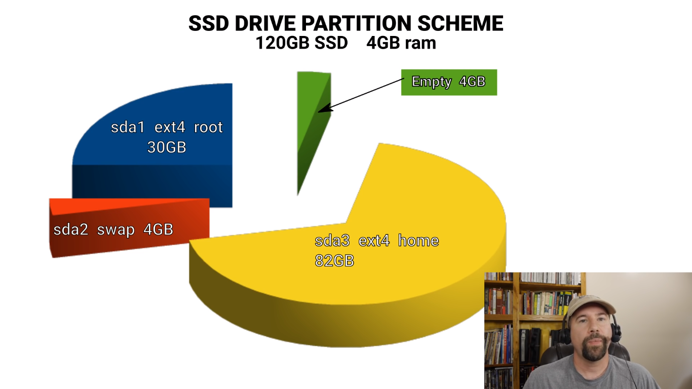

# Basic-Linux-Drive-Partition-Schemes

[YouTube cideo Source: AJ Reissig — Basic Linux Drive Partion Schemes](https://www.youtube.com/watch?v=71msHISl9kQ)

## Partition Scheme for SSD

| Capacity in MiB | Mount Point | Partition | Starting Point | Filesystem | Extended Partition |
| --- | --- | --- | --- | --- | --- |
| 4096 | Unallocated | Unallocated | Unallocated | Unallocated | Unallocated |
| 61440 | / | Primary | Beginning | Ext4 | N/A | Logical |
| 16384 | /swap | Primary | Beginning | N/A | Logical |
| What's left | /home | Primary | Beginning | Ext4 | N/A |

## Partition Scheme for HDD

| Capacity in MiB | Mount Point | Partition | Starting Point | Filesystem | Extended Partition |
| --- | --- | --- | --- | --- | --- |
| 512 | /boot | Primary | Beginning | Ext2 | N/A |
| 61440 | / | Primary | Beginning | Ext4 | N/A | Logical |
| 16384 | /swap | Primary | Beginning | N/A | Logical |
| What's left | /home | Primary | Beginning | Ext4 | N/A |

